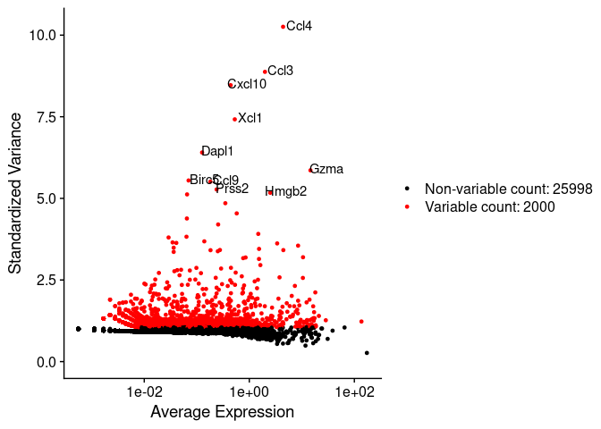
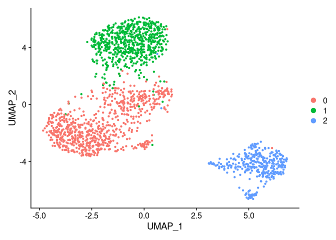
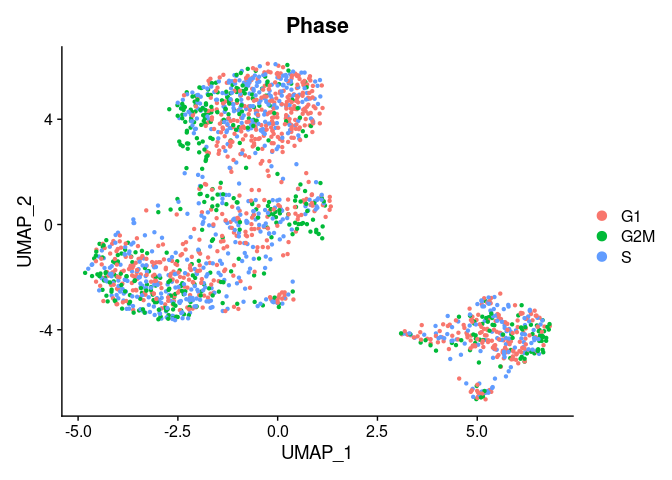

# Lecture 1

These slides are part of a workshop by the Cui Lab on 6/21/21 about how to use R to analyze single-cell RNA sequencing data. It starts by going over the basics of scRNA-seq and how it differs from bulk RNA-seq. We'll then download a publicly available dataset and analyze it together using the attached script.

Feel free to look at or download the slides below!

<iframe src="https://mcw0-my.sharepoint.com/personal/smazurchuk_mcw_edu/_layouts/15/Doc.aspx?sourcedoc={3aff0dd7-cf2b-42e6-8e6f-27994b5c9b9c}&amp;action=embedview&amp;wdAr=1.7777777777777777" width="1000px" height="600px" frameborder="0">This is an embedded <a target="_blank" href="https://office.com">Microsoft Office</a> presentation, powered by <a target="_blank" href="https://office.com/webapps">Office</a>.</iframe>

### Results

This is an R Markdown document. Code can only be written in chunks,
which are set off by sets of three tick marks (\`\`\`).

Spaces between chunks can be used to take notes.

To add a new chunk, click the “Insert” icon towards the top right of the
script section of RStudio. Then select “R” from the dropdown menu.
Alternatively, press Command + Option + I (Mac) or Control + Alt + I
(Windows) on your keyboard.

You can name chunks by typing a name after the letter “r” inside the
curly braces. The drop down menu in the bottom left of the script
section of RStudio allows you to skip to any chunk, so naming chunks
makes it easy to keep track of where you want to skip to in your script.

    # Inside a chunk, anything in a line written after a pound sign/hashtag is a comment and will not be run as code
    # Use comments to take notes in line with your code

    install.packages("Seurat")

    ## Installing package into '/home/smazurchuk/R/x86_64-pc-linux-gnu-library/4.1'
    ## (as 'lib' is unspecified)

    install.packages("tidyverse")

    ## Installing package into '/home/smazurchuk/R/x86_64-pc-linux-gnu-library/4.1'
    ## (as 'lib' is unspecified)

    # Downloaded packages are not automatically available for use in R
    # The library() function loads packages for use in one session of R
    # If you restart R, you don't need to install the packages again, but you do need to library() them

    library(Seurat)

    ## Attaching SeuratObject

    library(tidyverse)

    ## Registered S3 method overwritten by 'cli':
    ##   method     from         
    ##   print.boxx spatstat.geom

    ## ── Attaching packages ─────────────────────────────────────── tidyverse 1.3.1 ──

    ## ✓ ggplot2 3.3.5     ✓ purrr   0.3.4
    ## ✓ tibble  3.1.4     ✓ dplyr   1.0.7
    ## ✓ tidyr   1.1.3     ✓ stringr 1.4.0
    ## ✓ readr   2.0.1     ✓ forcats 0.5.1

    ## ── Conflicts ────────────────────────────────────────── tidyverse_conflicts() ──
    ## x dplyr::filter() masks stats::filter()
    ## x dplyr::lag()    masks stats::lag()

    # Seurat expects the input files to be called "barcodes.tsv.gz", "features.tsv.gz", and "matrix.mtx.gz"
    # We first need to rename the downloaded files to make them match these names exactly

    file.rename("matrix_files/GSM3701181_GP33_day30_barcodes.tsv.gz", "matrix_files/barcodes.tsv.gz")

    ## [1] TRUE

    file.rename("matrix_files/GSM3701181_GP33_day30_genes.tsv.gz", "matrix_files/features.tsv.gz")

    ## [1] TRUE

    file.rename("matrix_files/GSM3701181_GP33_day30_matrix.mtx.gz", "matrix_files/matrix.mtx.gz")

    ## [1] TRUE

    Cl13.raw <- Read10X(data.dir = "matrix_files/")

    # Cl13.raw is currently stored as a matrix object in R (matrix of genes and cells)
    # We can check how many cells and genes are available for analysis with the dim() function

    dim(Cl13.raw)

    ## [1] 27998  1838

    # 27998  1838

    # dim() always returns the number of rows, then the number of columns in a matrix or data frame
    # scRNA-seq data is always arranged such that rows are genes and columns are cells
    # Therefore, this dataset has 27,998 genes detected across 1,838 cells

    # We need to make a Seurat object from the matrix object Cl13.raw

    Cl13 <- CreateSeuratObject(counts = Cl13.raw, project = "Cl13")

    # You can also call dim() on Seurat objects to see how many genes and cells are in your dataset
    dim(Cl13)

    ## [1] 27998  1838

    # 27998  1838

    # Not all cells are usable for analysis, so we need to filter out low quality cells

    # First, have Seurat calculate what percentage of the transcriptome of each cell comes from mitochondrial genes
    # Cells with high percentages of mitochondrial mRNA may be apoptotic
    # Note that all mitochondrial genes being with "mt-", so Seurat can easily find these genes
    Cl13$percent.mt <- PercentageFeatureSet(object = Cl13, pattern = "^mt-")

    # View the number of unique genes (nFeature_RNA), number of total transcripts (nCount_RNA), and percent of mitochondrial reads (percent.mt) for each cell
    VlnPlot(object = Cl13, features = c("nFeature_RNA", "nCount_RNA", "percent.mt"))

    # Notice how some cells have many more unique genes than most cells
    # These cells may be doublets (two cells captured in the same oil droplet and labeled with the same barcode sequence)
    # We need to remove these cells to prevent contamination

    # We generally also remove cells with very few unique genes per cell, as these cells will not provide much information and may decrease the quality of the analysis
    # Cells in this dataset are above the typical minimal threshold (200 genes per cell)

    # Live cells will have a low percentage of mitochondrial mRNA, so we also use this metric to filter cells
    # Typical cutoffs for percent.mt are 5-10% depending on how stringent you want your quality control to be and how many cells you can afford to filter out

    Cl13 <- subset(Cl13, subset = nFeature_RNA > 200 & nFeature_RNA < 2500 & percent.mt < 10)

    # Normalize the data - divides the number of reads for each gene in a cell by the total number of reads in that cell
    # Normalization makes reads comparable betwwen cells that had different read depth during sequencing
    Cl13 <- NormalizeData(Cl13)

    # Select highly variable features - these will be used for PCA/UMAP
    # Running PCA/UMAP on all genes is computationally intensive and doesn't really improve results
    Cl13 <- FindVariableFeatures(Cl13)

    # You can examine the variable features on a plot if you want to see them
    LabelPoints(VariableFeaturePlot(Cl13),
                points = head(VariableFeatures(Cl13), 10))

    ## Warning: Transformation introduced infinite values in continuous x-axis

    ## Warning: Removed 14339 rows containing missing values (geom_point).

    # Load genes for cell cycle regression
    CC_genes <- Seurat::cc.genes.updated.2019

    # These genes are currently in human gene format (all caps)
    # We need to change them to mouse gene format (first letter caps, all other letters lowercase)
    CC_genes <- lapply(CC_genes, function(x){
      paste0(
      substring(x, 1, 1),
      tolower(substring(x, 2)))})

    # Calculate the cell cycle phase of cells
    Cl13 <- CellCycleScoring(Cl13, s.features = CC_genes$s.genes, g2m.features = CC_genes$g2m.genes)

    ## Warning: The following features are not present in the object: Pimreg, Jpt1, not
    ## searching for symbol synonyms

    # Note that not all cell cycle genes will always be found in each dataset

    # Scale the data - scales the expression of each gene across all cells to a range centered at 0 (usually -2 to +2)
    # While scaling, we'll also regress out cell cycle phase scores so these don't impact data scaling
    # By default, Seurat only scales variable genes, which we found with the FindVariableFeatures() function earlier
    Cl13 <- ScaleData(Cl13, vars.to.regress = c("S.Score", "G2M.Score"))

    ## Regressing out S.Score, G2M.Score

    ## Centering and scaling data matrix

    # If you want to scale all genes, for example to generate large heatmaps later, you need to specify this
    # We aren't doing this today for the sake of time, but the command to do so is below
    # Cl13 <- ScaleData(Cl13, features = rownames(Cl13), vars.to.regress = c("S.Score", "G2M.Score"))

    # We need to generate a PCA plot before we contruct a UMAP plot
    # By default, 50 PCs are calculated; you can choose to set fewer PCs manually
    Cl13 <- RunPCA(Cl13, npcs = 30)

    ## PC_ 1 
    ## Positive:  Ccl5, Gzmb, Gzma, Cx3cr1, Zeb2, Ahnak, Lgals1, Ccl4, Klre1, S1pr5 
    ##     Klrc1, Crip1, Rap1b, Id2, Emp3, Lgals3, Cd48, S100a6, Klrd1, Ifngr1 
    ##     S100a4, Spn, Txk, Il18rap, Klrc2, Vim, Calm1, Actb, Klrb1c, Klrg1 
    ## Negative:  Rps28, Rps18, Rpl13, Slamf6, Rps19, Tcf7, Rplp1, Rpl39, Rps29, Rps20 
    ##     Rps9, Rplp2, Rps15a, Xcl1, Rpl32, Rpl37, Rpl23, Rps16, Rps7, Id3 
    ##     Il7r, Rps6, Rpl36a, Rpl35, Rpl36, Ltb, Rplp0, Rpl12, Rpl41, Rps5 
    ## PC_ 2 
    ## Positive:  Lgals1, Ly6c2, Cx3cr1, Zeb2, Tmsb10, Ahnak, Atp1b3, Klrd1, Klf2, Il18rap 
    ##     S100a10, Klrk1, Klre1, S1pr5, Klrc1, Il18r1, Klf3, Vim, Rap1b, Emp3 
    ##     Itgb1, H2afz, Spn, Tagln2, Rasgrp2, S1pr1, S100a4, Klrg1, Pycard, Rpl41 
    ## Negative:  Cd7, Rgs1, Nr4a2, Lag3, 2900026A02Rik, Cd160, Gzmk, Tox, Cd244, Sept4 
    ##     Sh2d2a, AW112010, Ptger4, Cxcr6, Pdcd1, Ccl4, Ccl3, Lax1, Abi3, Ikzf2 
    ##     Serpina3g, Abcb9, Maf, Adgrg1, Adam19, Chn2, Cd200r1, Actn2, Cd27, Tnfrsf9 
    ## PC_ 3 
    ## Positive:  Zeb2, Klre1, S1pr5, Klra9, Rps29, PISD, Gzma, Klrc2, Klrb1c, Kcnj8 
    ##     Tcf7, Klf2, Txk, Il7r, Id3, Rps28, Klrk1, Kcnq1ot1, Il18rap, Klrd1 
    ##     Bcl2l11, Itgb1, Tnfsf8, Arl4c, Xcl1, Zfp36l1, Bcl2, Klra3, Rpl36, As3mt 
    ## Negative:  Actg1, Sub1, Pfn1, S100a6, S100a11, S100a4, Crip1, Coro1a, Lgals3, Lsp1 
    ##     Glipr2, Gapdh, Ccnb2, Rbm3, Txn1, Arpc4, Actr3, Cotl1, Vim, Ifi27l2a 
    ##     Prdx1, Lrrc58, Calm1, AW112010, Anxa2, Ube2c, Ywhah, S100a10, Arpc5, Rom1 
    ## PC_ 4 
    ## Positive:  Ifit3, Ifit1, Rsad2, Isg15, Usp18, Ifit3b, Irf7, Ifi204, Slfn8, Slfn5 
    ##     Rtp4, Pydc3, Pydc4, Gm4955, Ifih1, Oas3, Isg20, Trim30a, Iigp1, Cxcl10 
    ##     Stat1, Herc6, Cmpk2, Zbp1, Pyhin1, Oasl2, Mx1, Mnda, Bst2, Oasl1 
    ## Negative:  Pfn1, Actg1, Rps7, Gm9493, Tnfrsf9, S100a6, Gapdh, Rplp0, Rpl10, Coro1a 
    ##     Rpl3, Rps6, Adam19, Rps15a, Rpl4, Rps2, S100a4, Rpl41, Snhg6, Rpl36a 
    ##     Rpl39, Pglyrp1, Chchd10, Rpl32, S100a11, Rpl22l1, Etfb, Ggt1, Sub1, Ctla2a 
    ## PC_ 5 
    ## Positive:  Hmmr, Birc5, Ccna2, Kif4, Ckap2l, Casc5, Cenpf, Esco2, Neil3, 2810417H13Rik 
    ##     Rrm2, Cdca8, Hist1h1b, Aspm, Kif14, Kif22, Kifc1, Nusap1, Tpx2, Cdca3 
    ##     Nsl1, Mxd3, Cenph, Pbk, Hist1h2ap, Cdc20, Kif2c, Ccnb2, Bub1, Rad54b 
    ## Negative:  Hmgb2, Smc4, Ccl5, Rpl32, Rpl39, Rpl37, Rpl13, Rpl10a, Rps7, Rps15a 
    ##     Rpl23a, Samhd1, Rpl18, Rpl3, Ifit1bl1, Rps6, Rpl36, Rpl41, Rps18, Plac8 
    ##     Rplp2, Rps16, Rps10, Rplp1, Epsti1, Rplp0, Ifit1, Crip1, Rps19, Rpl4

    Cl13 <- FindNeighbors(Cl13, dims = 1:30)

    ## Computing nearest neighbor graph

    ## Computing SNN

    Cl13 <- FindClusters(Cl13, resolution = 0.3)

    ## Modularity Optimizer version 1.3.0 by Ludo Waltman and Nees Jan van Eck
    ## 
    ## Number of nodes: 1790
    ## Number of edges: 101145
    ## 
    ## Running Louvain algorithm...
    ## Maximum modularity in 10 random starts: 0.8835
    ## Number of communities: 5
    ## Elapsed time: 0 seconds

    Cl13 <- RunUMAP(Cl13, dims = 1:30)

    ## Warning: The default method for RunUMAP has changed from calling Python UMAP via reticulate to the R-native UWOT using the cosine metric
    ## To use Python UMAP via reticulate, set umap.method to 'umap-learn' and metric to 'correlation'
    ## This message will be shown once per session

    ## 20:22:35 UMAP embedding parameters a = 0.9922 b = 1.112

    ## 20:22:35 Read 1790 rows and found 30 numeric columns

    ## 20:22:36 Using Annoy for neighbor search, n_neighbors = 30

    ## 20:22:36 Building Annoy index with metric = cosine, n_trees = 50

    ## 0%   10   20   30   40   50   60   70   80   90   100%

    ## [----|----|----|----|----|----|----|----|----|----|

    ## **************************************************|
    ## 20:22:36 Writing NN index file to temp file /tmp/RtmpoMHdPC/file284943be0bcc1
    ## 20:22:36 Searching Annoy index using 1 thread, search_k = 3000
    ## 20:22:36 Annoy recall = 100%
    ## 20:22:36 Commencing smooth kNN distance calibration using 1 thread
    ## 20:22:37 Initializing from normalized Laplacian + noise
    ## 20:22:37 Commencing optimization for 500 epochs, with 74660 positive edges
    ## 20:22:39 Optimization finished

    # Show the UMAP plot
    DimPlot(Cl13)

    # Clusters are numbered by decreasing size

    # There isn't a set number of PCs to use for PCA or UMAP construction
    # In general, PCs are set between 10 and 50
    # It's usually better to use more PCs than fewer, as too few PCs will drastically alter the data whereas extra PCs will hardly change the overall structure of the data
    # The larger the dataset, the more PCs should be used

    # Resolution in FindClusters() doesn't affect the shape of the clusters but does affect the coloring (cluster assignment) of cells
    # Look at what happens when we change only the resolution and recreate the UMAP plot
    Cl13 <- FindClusters(Cl13, resolution = 0.2)

    ## Modularity Optimizer version 1.3.0 by Ludo Waltman and Nees Jan van Eck
    ## 
    ## Number of nodes: 1790
    ## Number of edges: 101145
    ## 
    ## Running Louvain algorithm...
    ## Maximum modularity in 10 random starts: 0.9131
    ## Number of communities: 3
    ## Elapsed time: 0 seconds

    DimPlot(Cl13)

    # Alternatively, we can color the cells based on their cell cycle phase instead of their cluster identity
    DimPlot(Cl13, group.by = "Phase")

    # Always test to make sure that your cell populations are pure, even if you sequenced FACS-sorted cells (sorting is never perfect)
    # In this case, the cells are supposed to be LCMV GP33-specific CD8 T cells
    # We can examine identity genes with different plots
    VlnPlot(Cl13, features = c("Cd8a", "Cd3e"))

    FeaturePlot(Cl13, features = c("Cd8a", "Cd3e"))

    # All clusters express high levels of Cd3e and CD8a, suggesting that these cells are CD8 T cells

    # If we don't know what genes are important, we can analyze differentially expressed genes (DEGs) in each cluster
    Cl13_markers <- FindAllMarkers(Cl13, only.pos = T)

    ## Calculating cluster 0

    ## For a more efficient implementation of the Wilcoxon Rank Sum Test,
    ## (default method for FindMarkers) please install the limma package
    ## --------------------------------------------
    ## install.packages('BiocManager')
    ## BiocManager::install('limma')
    ## --------------------------------------------
    ## After installation of limma, Seurat will automatically use the more 
    ## efficient implementation (no further action necessary).
    ## This message will be shown once per session

    ## Calculating cluster 1

    ## Calculating cluster 2

    # Setting only.pos = T tells Seurat to only look for genes that are upregulated in each cluster

    # Let's examine the top 10 DEGs per cluster
    Cl13_markers %>% group_by(cluster) %>% top_n(10, wt = avg_log2FC)

    ## # A tibble: 30 × 7
    ## # Groups:   cluster [3]
    ##        p_val avg_log2FC pct.1 pct.2 p_val_adj cluster gene 
    ##        <dbl>      <dbl> <dbl> <dbl>     <dbl> <fct>   <chr>
    ##  1 1.44e-165       2.97 0.712 0.116 4.03e-161 0       Cd7  
    ##  2 4.87e- 88       1.47 0.656 0.211 1.36e- 83 0       Cxcr6
    ##  3 1.62e- 83       1.26 0.706 0.255 4.54e- 79 0       Gzmk 
    ##  4 1.60e- 66       1.74 0.699 0.37  4.49e- 62 0       Rgs1 
    ##  5 1.07e- 64       1.22 0.703 0.346 2.98e- 60 0       Lag3 
    ##  6 1.79e- 63       1.65 0.867 0.564 5.01e- 59 0       Ccl4 
    ##  7 5.34e- 61       1.81 0.695 0.351 1.49e- 56 0       Ccl3 
    ##  8 8.52e- 53       1.29 0.433 0.127 2.39e- 48 0       Maf  
    ##  9 1.35e- 51       1.24 0.708 0.408 3.78e- 47 0       Nr4a2
    ## 10 8.70e- 49       1.22 0.418 0.13  2.43e- 44 0       Cd160
    ## # … with 20 more rows

    # Note that gene names don't always match protein names (Pdcd1 = PD-1, Slamf6 = Ly108)

    # We can plot some of these genes to visualize how specific they are to each cluster
    VlnPlot(Cl13, features = c("Cxcr6", "Nr4a2", "Cx3cr1", "Zeb2", "Slamf6", "Il7r"))

    DotPlot(Cl13, features = c("Cxcr6", "Nr4a2", "Cx3cr1", "Zeb2", "Slamf6", "Il7r"))

    FeaturePlot(Cl13, features = c("Cxcr6", "Nr4a2", "Cx3cr1", "Zeb2", "Slamf6", "Il7r"))

    RidgePlot(Cl13, features = c("Cxcr6", "Nr4a2", "Cx3cr1", "Zeb2", "Slamf6", "Il7r"))

    ## Picking joint bandwidth of 0.144

    ## Picking joint bandwidth of 0.226

    ## Picking joint bandwidth of 0.0622

    ## Picking joint bandwidth of 0.0646

    ## Picking joint bandwidth of 0.0817

    ## Picking joint bandwidth of 0.086

    # Using our knowledge of CD8 T cell biology from the literature and our own experiments, we can determine cluster identities:
    # Cluster 0 - Exhausted cells
    # Cluster 1 - Effector cells
    # Cluster 2 - Progenitor cells

    # To make figures easier to follow, we can rename the clusters in our Seurat object
    Cl13 <- RenameIdents(Cl13,
                         "0" = "Exhausted",
                         "1" = "Effector",
                         "2" = "Progenitor")

    # Check to make sure the new names are okay
    DimPlot(Cl13)

    # Make a folder for figures
    dir.create("Figures")

    # The ggsave() function saves plots into a directory you want in a file format you specify
    # ggsave() automatically saves the last plot run in R, so place this command directly after the plot you want to save and run them together
    # Remember to include the "Figures" in the file path inside ggsave()
    # Tip: In RStudio, you can press the Tab key inside quotation marks to automatically list and select file paths

    # UMAP
    # Most plotting functions in Seurat allow you to easily change the colors of the clusters as well
    # Remember that colors are specified in the order that the clusters are listed (by default, clusters are arranged in alphabetical order)
    DimPlot(Cl13, cols = c("gray50", "red", "skyblue"))

    ggsave("Figures/UMAP.png", dpi = 300)

    ## Saving 7 x 5 in image

    # dpi specifies the image resolution for PNG files; always save at 300 dpi (the default is 72 dpi, which is lower resolution and not acceptable for publications)

    # UMAP colored by cell cycle phase
    DimPlot(Cl13, group.by = "Phase")

    ggsave("Figures/UMAP_cell_cycle.png", dpi = 300)

    ## Saving 7 x 5 in image

    # FeaturePlot to verify cell purity
    FeaturePlot(Cl13, features = c("Cd3e", "Cd8a"))

    ggsave("Figures/Cell_purity_FeaturePlot.png")

    ## Saving 7 x 5 in image

    # VlnPlot of major markers defining each subset
    # Rememer to keep the colors you pick consistent if you don't want to use the default colors
    VlnPlot(Cl13, features = c("Pdcd1", "Cx3cr1", "Slamf6"), cols = c("gray50", "red", "skyblue"))

    ggsave("Figures/Cluster_markers_VlnPlot.png", dpi = 300)

    ## Saving 7 x 5 in image

    # DotPlot of differentially expressed genes from FindAllMarkers() that may be of interest
    # We'll manually set the height and width of this file so the text on the x-axis fits properly
    DotPlot(Cl13, features = c("Pdcd1", "Cxcr6", "Nr4a2", "Cx3cr1", "S1pr5", "Tbx21", "Slamf6", "Il7r", "Tcf7"))

    ggsave("Figures/Cluster_markers_DotPlot.png", dpi = 300, width = 9, height = 5)

    # 5 figures in 1 hour
    # Price: $0

    # Further analyses can be conducted with the following packages:
    #   Monocle - Psuedotime trajectory analysis
    #   VeloCyto - RNA Velocity
    #   SCENIC - regulon (transcription factor gene regulatory network) analysis
    #   CellPhoneDB - Cell-cell receptor-ligand interactions (currently only available as a Python package)
    #   ggpubr - easy statistical analysis for violin or box plots
    #   novoSpaRc - de novo or atlas-based spatial reconstruction of scRNA-seq data (currently only available as a Python package)
